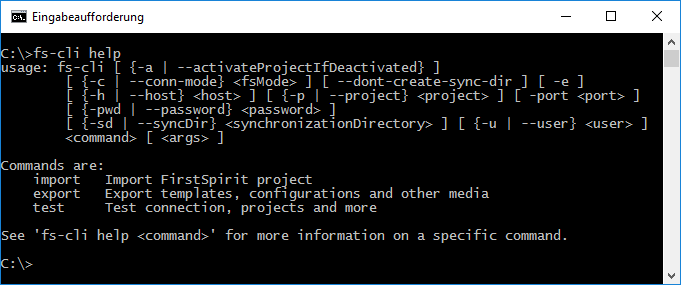
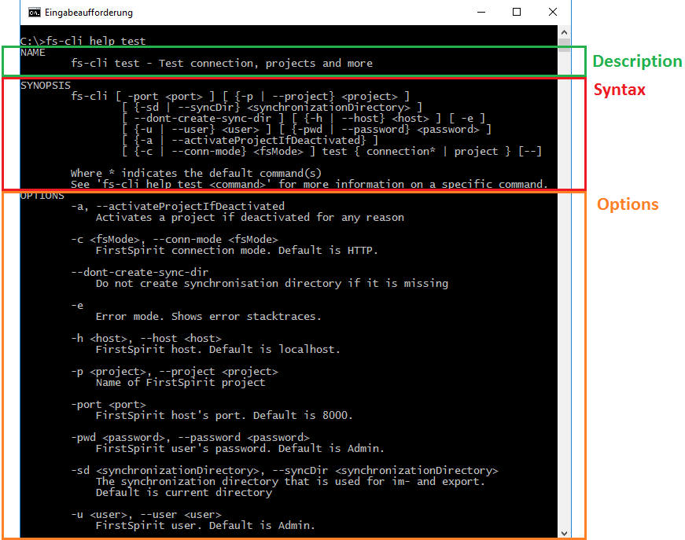
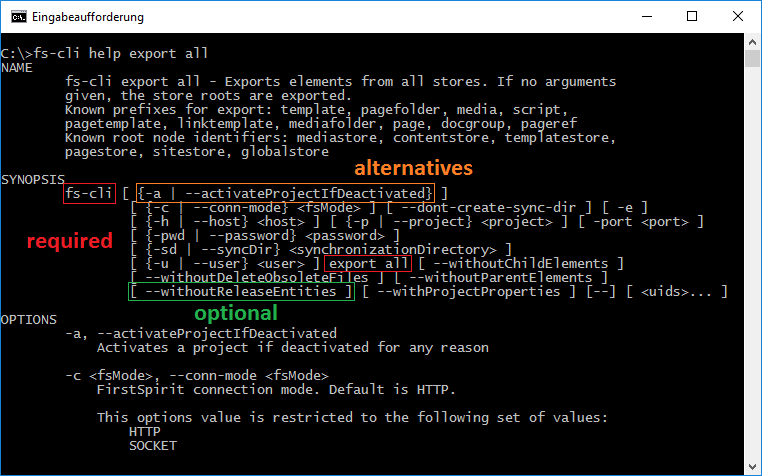
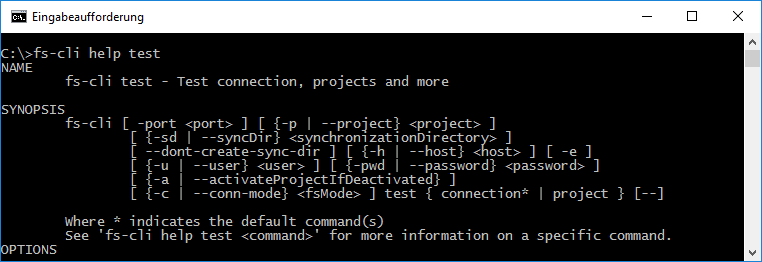

# Command Line Interface Usage

## Introduction

Most of the information you need in order to use the command line tool can be found via the integrated help command.
See `fs-cli help` for more information on how to use the command:

## How to read the online help

### Base structure

The online help is devided in three main sections with optional fourth example section:

- Name (command name and short command description)
- Synopsis (command syntax)
- Options (description of the command options and their vaules)
- Examples (command examples; not shown below)

### Syntax

In the *SYNOPSIS* section the command syntax is explained. While surroundings by
- *square brackets* like **[ ... ]** indicate **optional** command elements,
- *curly braces and pipes* like **{ ... | ... }** list **alternative** command elements
- `plain text` are **required** command elements which must be provided in the order of the specified syntax.

In general, the command line interface offers a set of sub commands, that can be grouped. A command can be configured with options and
additional global options. The global options have to be stated first and before the command, while the
command's options have to be stated after the command itself. The order of options and global options within
their regions is arbitrary.

While groups behave mostly like commands - because a default command is executed
if specified for a group - the description of a group might give information about several commands.
In order to get information about all known commands or command groups, use `fs-cli help`. Information about a command
or a group can be retrieved with `fs-cli help commandogroup`. Besides that, examples are provided per command.
Every command description also features information about the command's specific options and all global options.

Exampe online help for test command group (enter `fs-cli help test`):

