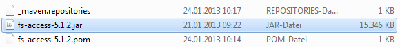

# Developer Documentation

## Dependencies
The FS DevTools compiles only with **Java 8** and **FirstSpirit 5.2R3** (version 5.2.311) or newer. Since the required FirstSpirit artifacts are not public available the steps in the next section must be done.

### Use FirstSpirit Access API as maven dependency

To enable the amended source code to be compiled successfully, the fs-access.jar file of the FirstSpirit Server used must be installed in the local Maven repository first. The **fs-access.jar** file is located in the directory:
```
<FirstSpirit Server directory>/data/fslib
```
It is installed by entering the following command into the command line:
```console
mvn install:install-file -Dfile=<path-to-acces.jar> -DgroupId=de.espirit.firstspirit -DartifactId=fs-access -Dversion=<fs version e.g. '5.0.0'> -Dpackaging=jar
```
Within this command, the parameters for the path to the **fs-access.jar** file and the FirstSpirit version used must be substituted accordingly.
```console
mvn install:install-file -Dfile=C:\fs-access.jar -DgroupId=de.espirit.firstspirit -DartifactId=fs-access -Dversion=5.1.2 -Dpackaging=jar
```

**Note:** *Running the installation command within the directory in which the **pom.xml** file has been saved leads to an error. The installation must therefore be performed outside this directory.*

During installation, the local Maven repository has been automatically created in the user directory under **<user's home>.m2/repository**. After the **fs-access.jar** file has been successfully installed, it should be located in this directory (see figure below):



## Compile with Maven
Simply type on command line at project root:

```console
mvn clean package
```

If you need to provide a specific version and FirstSpirit version please type:

```
mvn clean package -Dfirstspirit.version=FS_VERSION
```

If you need to build a custom version of FS DevTools please type:

```
mvn clean package -Dci.version=VERSION
```


## Extending

This tool should be easily expandable with further commands, while the *execution framework* should rarely needed to be touched at all. 

For your convenience, you can add commands and groups. Our cli assumes, that you place your commands in the existing command package (**com.espirit.moddev.cli.commands**) and your new groups in the existing group package (**com.espirit.moddev.cli.groups**) in the cli module. Since those packages are configured to be scanned, there's no need to further register commands or anything. 
Since our tool relies on the airline library (https://github.com/airlift/airline), you have to annotate your class with a `@Command` annotation and implement our `Command` interface. 

By default, our commands use a connection to a FirstSpirit server. A global configuration for commands, as well as a context, is made available through the `Config` interface. A general implementation is provided by our `GlobalConfig` class. If you implement a configuration, our execution environment uses the command itself for the connection configuration and initializes the connection for you right before the command execution. 

For your convenience, we provided the [`SimpleCommand`](https://github.com/e-Spirit/FSDevTools/blob/master/fsdevtools-cli/src/main/java/com/espirit/moddev/cli/commands/SimpleCommand.java) class that can be extended to prevent you from specifying standard connection logic for each command. The pure logic you want to program can then be placed in the generic `call` method you know from java's `Callable` interface and you are all done.

For help configurations, take a look at existing commands and their annotations. If you really need it, you can have dynamic descriptions via a `public static String getDescription()` method in your command class (have a look at our [ExportCommand class](https://github.com/e-Spirit/FSDevTools/blob/master/fsdevtools-cli/src/main/java/com/espirit/moddev/cli/commands/export/ExportCommand.java)).
